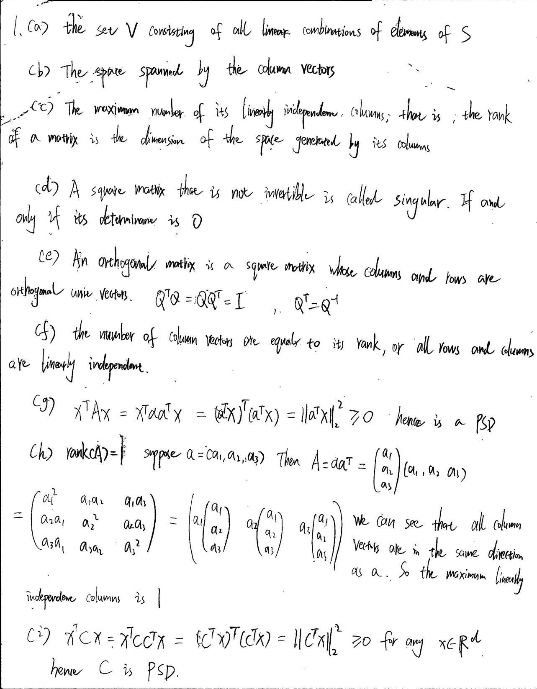
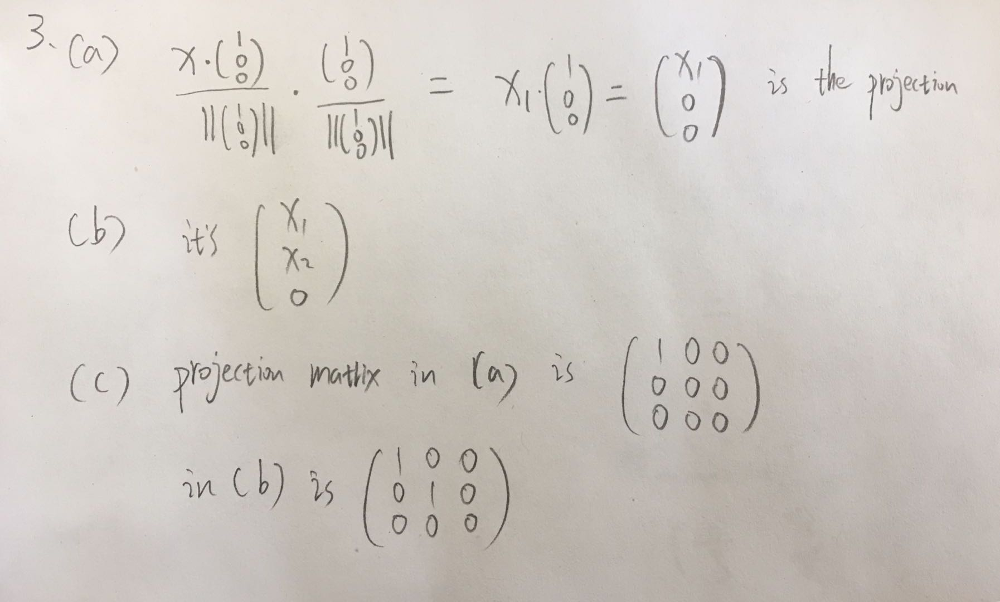

```{r setup, include=FALSE}
knitr::opts_chunk$set(echo = TRUE)
library(mosaic)
library(pracma)
library (MASS)
```
### 1


### 2 Eigendecomposition with R

a)
```{r}
X = matrix(c(1,2,2,1),2,2,byrow = TRUE)
Y = matrix(c(-1/3,2/3,2/3,-1/3),2,2,byrow = TRUE)
X
Y
```
b)
```{r}
solve(X)
solve(Y)
```
both X and Y are invertible because their determinants are not zero. One could use `solve` function

c)
```{r}
eigen(X)
```

d)
Since Y is the inverse of X, it has eigenvalues $\lambda^{'} =\frac{1}{\lambda}$. So Y have
the same eigenvectors as X and 1/3 and -1 as eigenvalues.
\[ A^{-1}Ax = A^{-1}\lambda x\\
x= \lambda A^{-1}x\\
A^{-1}x= \frac{1}{\lambda}x
\]

e)
$A^2$ has the square of A's eigenvalues and same eigenvectors. So eigenvalues of $X^2$ are 1 and 9. 
\[ A^2x = A\lambda x\\
= \lambda Ax\\
= \lambda^2x
\]

f)

\[ Ax = \lambda x\\
A^2x = A\lambda x\\
A^2x= \lambda Ax\\
A^2x = \lambda \lambda x\\
A^2x= \lambda^2x
\]

### 3 Understanding orthogonal projection


d)
```{r}
a = matrix(c(1,rep(0,8)),3,3,byrow = TRUE)
b = matrix(c(1,0,0,0,1,0,0,0,0),3,3,byrow = TRUE)
set.seed(123)
vec1 = runif(3)
vec2 = runif(3)
a %*% vec1
a %*% vec2
b %*% vec1
b %*% vec2
```
e) the projetion matrix is $P=X(X^{T}X)^{-1}X^{T}$ or
let the unit vector $u = \frac{a}{||a||}$ and $P = uu^{T}$

f)
```{r}
projection = function(a,x){
  P =a %*% solve(t(a) %*% a) %*% t(a)
  return(P %*% x)
}
x = c(3,2,-1)
a = c(1,0,1)
projection(a,x)

au = a/sqrt(2)#unit vector
pp = t(t(au)) %*% t(au)
pp %*% x
```
g)
let X=(a1,a2), orthogonal projection = $X(X^{T}X)^{-1}X^{T}x$ or,
the vector addition of orthogonal projection of x onto a1 and orthogonal projection of x onto a2

h)
use Gram Schmidt Orthogonalization to convert a1 and a2 into orthonormal basis u1, u2. Let v1 be the projection of x onto u1, and Let v2 be the projection of x onto u2 Then orthogonal projection x onto span(a1,a2) is v1+v2  
or just use projection matrix $P=X(X^{T}X)^{-1}X^{T}$

i)
```{r}
# Gram Schmidt
u = gramSchmidt(X)
u1  = u$Q[,1]
u2 =  u$Q[,2]
v1 = project(x, u1)
v2 = project(x, u2)
v1 + v2
```
j)
use Gram Schmidt Orthogonalization to convert a1,a2,...,ak into orthonormal basis u1,u2,...,uk. Let the projection of x onto u1 be v1, the projection of x onto u2 be v2 and so on. The final result is v1+v2+...+vk  

(l)

```{r}
X = matrix(c(1,0,1,1,-1,0),3,2)
P =X %*% solve(t(X) %*% X) %*% t(X)
P %*% x
```
We got the same result as in part (i)

m)
Column vectors are orthogonal. $A(A^{T}A)^{-1}A^{T}x = A(D)A^{T}x $ where D is a diagnoal matrix with $a_i^{T}a_i$ on the diagonal.

### 4 Exploring a dataset with R
a)
```{r}
library(MASS)
?Boston
nrow(Boston)
ncol(Boston)
```
The data consists of 14 variables (i.e. features) and 506 observations. Each observation is a subdivision of a county in Boston. The 14 variables are:    
1. crim: per capita crime rate by town   
2. zn: proportion of residential land zoned for lots over 25,000 sq.ft  
3. indus: proportion of non-retail business acres per town  
4. chas: Charles River dummy variable (= 1 if tract bounds river; 0 otherwise)  
5. nox: nitric oxides concentration (parts per 10 million)  
6. rm: average number of rooms per dwelling  
7. age: proportion of owner-occupied units built prior to 1940  
8. dis: weighted distances to five Boston employment centres  
9. rad: index of accessibility to radial highways  
10. tax: full-value property-tax rate per USD 10,000  
11. ptratio: pupil-teacher ratio by town  
12. b: 1000(B - 0.63)^2 where B is the proportion of blacks by town  
13. lstat: percentage of lower status of the population  
14. medv: median value of owner occupied homes in USD 1000's  

b)
```{r}
pairs(Boston)
# library(GGally)
# ggpairs(Boston)
```
There are some variables having positive relationship like `medv` and `rm`.
and negative relationship like `medv` and `lstat`.

c)
the less the dis variable, the more crime rates.    
the less the zn variable, the more crime rates.  
the more the rad variable, the more crime rates.  

d)
```{r}
#There are many of the suburbs of Boston appear to have particularly high crime rates, tax rates and Pupil-teacher ratios. Below are the ranges for each variable.
range(Boston$crim)
range(Boston$tax)
range(Boston$ptratio)
```

e)
```{r}
nrow(Boston[Boston$chas == 1,])
```

f)
```{r}
median(Boston$ptratio)
```

g)
```{r}
Boston[Boston$medv == min(Boston$medv),]
#Age is at the max value. Tax is close to the max 711. Ptratio is close to the max 22.0
#the crime rates are different for two suburbs.
```

h)
```{r}
#more than seven
nrow(Boston[Boston$rm >7,])
#more than eight
nrow(Boston[Boston$rm >8,])
Boston[Boston$rm >8,]
#The age variable is big, and the medv variable is also big on average.
```

i)
all the suburbs in Boston

j)
Reality:  we have BostonHousing data with 506 observations and 14 variables.
Model: linear regression
Future Reality: predict the median housing price for a new suburb in Boston.


### 5 True or false
a) **Cross validation is a powerful tool to select hyper-parameters in several machine learning tasks.**  
False It's a method for selecting model not hyper-parameters.

b) **Cross validation error is always a good proxy for the prediction error.**  
False not always. Cross validation error uses hold out data set, but the true prediction error uses "future" test set. They are not same.

c) **Vanilla cross validation is a good idea for time-series data.**  
False. time-series data has correlations between data based on time. The k-fold hold out data set in time-series data is not exchangeable. The CV error is not a good index. 

d) **For a machine learning problem, exploratory data analysis by itself is generally sufficient to determine the complete relevance of the dataset for the problem.**  
False. There are relevance in data we cannot observe by EDA only. EDA can give us a basic sense but we need more method and model to dig out more relevance in the dataset.

e) **Data collection process usually has no-to-little influence on the outcome of a prediction problem.**  
False. Data collection determines a lot on how we formulate the problem and what the representives of the population are.

f) **For a model to make meaningful predictions on the future data, we need some similarity between the representative data that was used to build the model and the future data.**  
True. It's true that we need some similarity. For example, we cannot use US presidential election data to predict Russia presidential election.

g) **Prediction is often the end goal of a machine learning task.**  
False. Prediction sometimes is not enough. In order to find out the meaning behind the model we need to do more work. For example, how do we explain the relationship between smoking and lung canser. Can we conclude causation based on correlation and prediction performance?
