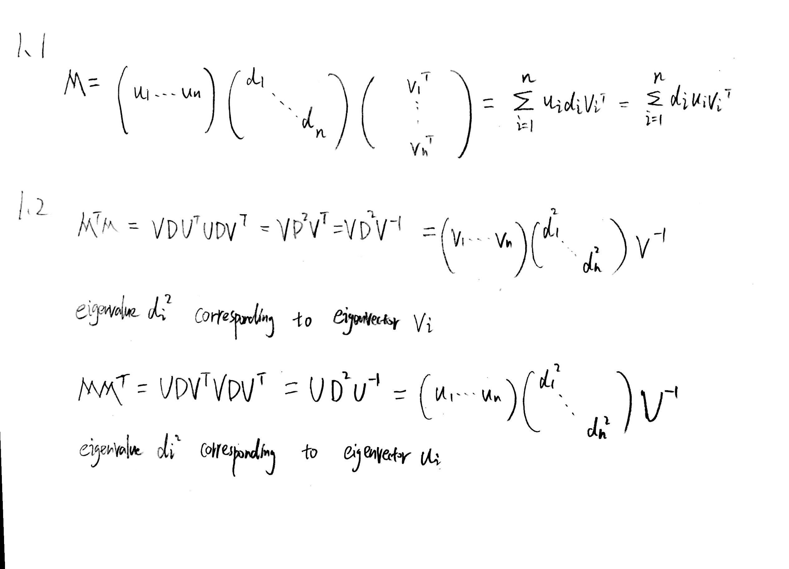

```{r setup, include=FALSE}
knitr::opts_chunk$set(echo = TRUE)
# library(mosaic)
# library(pracma)
# library (MASS)
library(ggplot2)
library(corrplot)
```
#### Honor Code

#### 1

\newpage

#### 1.3

```{r, eval=FALSE, echo=T}
n = c(2, 4, 8, 16, 32, 64, 128, 256, 512, 1024, 2048)
time_for_create = rep(0,length(n))
time_for_svd = rep(0,length(n))

for (i in 1:length(n)) {
  start =Sys.time()
  M = matrix(rnorm(n[i]*n[i]),n[i],n[i])
  end = Sys.time()
  time_for_create[i] = end - start
  
  start =Sys.time()
  svd(M)
  end = Sys.time()
  time_for_svd[i] = end - start
}
```

```{r, echo=T, eval=FALSE}
plot(n, log(time_for_create+1), type="l",ylab="time", col="red")
lines(n, log(time_for_svd+1), type="l", col="green")
legend('topright',c("time_for_create","time_for_svd") , 
   lty=1, col=c('red', 'green'), bty='n', cex=.75)

```
\newpage

#### 2.1 First eigenvector and eigenvector

```{r}
#a,b,c,e
power_method = function(A, d, k){
  #Start with an arbitrary vector w0
  w = rnorm(d)
  for (i in 1:k) {
    s = max(abs(A %*% w))
    w = (A %*% w) / s
  }
  w = w/ sqrt(sum(w^2))
  return(data.frame(w, s))
}
A  = matrix(c(1,2,3,2,-1,4,3,4,-5), 3,3,byrow = TRUE)
output = power_method(A,3,10)
w = output$w
s = output$s
```

```{r}
#d
(t(w) %*% A %*% w) / t(w) %*% w
max(abs(eigen(A)$values))
#they are very close
```

```{r}
eigen(A)
#
paste(c("eigenvector by power method: ", round(w,7)), collapse=" ")
paste(c("eigenvalue by power method: ", s[1]), collapse=" ")

```

#### 2.2 Defation and more eigenvectors
```{r}
#a
B = matrix(c(5,1,0,1,4,0,0,0,1), 3, 3, byrow = TRUE)

output = power_method(B,3,20)
lambda1 = output$s
v1 = output$w
```

```{r}
#b
B1 = B - lambda1 * v1 %*% t(v1)
output2 = power_method(B1, 3, 20)
lambda2 = output2$s
v2 = output2$w
```

```{r}
#c
B2 = B1 - lambda2 * v2 %*% t(v2)
output3 = power_method(B2, 3, 20)
lambda3 = output3$s
v3 = output3$w
evalues = round(c(lambda1[1],lambda2[1],lambda3[1]),5);evalues
evectors = matrix(round(c(v1,v2,v3),5),3,3);evectors
eigen(B)
#They are very close to R's output
```

#### 3 Principal Component Analysis

##### (a)
```{r, echo=FALSE}
dat = USArrests
paste("mean by col")
apply(dat,MARGIN = 2, mean)
paste("variance by col")
apply(dat,MARGIN = 2, var)
```

##### (b)

```{r, echo=FALSE}
par(mfrow=c(2,2))
hist(dat$Murder)
hist(dat$Assault)
hist(dat$UrbanPop)
hist(dat$Rape)
```

##### (c)

```{r, echo=FALSE}
#(c)
corrplot(cor(dat), type = "upper", method="number",order = "hclust", 
         tl.col = "black", tl.srt = 45)
```

we see that crimes(Rape, Murder and Assualt) have high correlations to each other while
UrbanPop does not.  

##### (d)
```{r, echo=FALSE}
#(d)
pca_prcomp <- prcomp(dat, scale. = TRUE)
summary(pca_prcomp)
```

##### (e)

```{r}
#(e)Obtain the principal vectors and store them in a matrix, include row and column names.
#Display the first three loadings.
pc_vectors = pca_prcomp$rotation
#first three loadings
pca_prcomp$rotation[,1:3]
```

##### (f)

```{r, echo=FALSE}
#(f)Obtain the principal components (or scores) and store them in a matrix, include row
#and column names. Display the first three PCs.
#scores = normalized(X) %*% loading matrix V
scores = pca_prcomp$x
#first three PCs
scores[,1:3]
```

##### (g)

```{r, echo=FALSE}
#(g) Obtain the eigenvalues and store them in a vector. Display the entire vector, and
# compute their sum.
eigenvalues = pca_prcomp$sdev ^ 2
eigenvalues
sum(eigenvalues)
```

##### (h)

```{r, echo=FALSE}
#(h) Create a scree-plot (with axis labels) of the eigenvalues. What do you see? How do you
#read/interpret this chart?
eigs_cum = cumsum(prop.table(eigenvalues))
ggplot() + geom_line(aes(x = 1:length(eigenvalues), y=eigs_cum)) +
  geom_point(aes(x = 1:length(eigenvalues), y=eigs_cum))+
 labs(x = "first PCs", y = "fraction of total variance explained")

# we can see the percentage of variance expalined by the number of first PCs. For example,
# the first two PCs explained 86% variance.
```

##### (i)

```{r, echo=FALSE}
#(i) Create a scatter plot based on the 1st and 2nd PCs. Which state stands out? Provide
#some explanations. In this plot you should annotate the points with state names.

# ggplot() + geom_point(aes(x = scores[, 1], y=scores[, 2])) +
# geom_text(aes(x = scores[, 1], y=scores[, 2], label=rownames(dat))) +
# labs(x = "PC1", y = "PC2")
biplot(prcomp(USArrests, scale = TRUE))
```

PC1 put equal weights on crimes and less weight on UrbanPop, so it measures overall crime rates  
PC2 put more weight on UrbanPop, so it indicates the population level.  
For example, California, Florida, Neveda have high population and high crime rates.  
States like New Mexico, Michigan, Maryland have low population but high crime rates.  

##### (j)

```{r, echo=FALSE}
#(j) Create the same scatter plot but color the states according to the variable UrbanPop.
ggplot() + geom_point(aes(x = scores[, 1], y=scores[, 2])) +
geom_text(aes(x = scores[, 1], y=scores[, 2], label=rownames(dat),colour=dat$UrbanPop)) +
labs(x = "PC1", y = "PC2")
```

##### (k)

```{r, echo=FALSE}
#(k) Create a scatter plot based on the 1st and 3rd PCs. Comment on the difference between
# this plot and the previous one.
ggplot() + geom_point(aes(x = scores[, 1], y=scores[, 3])) +
geom_text(aes(x = scores[, 1], y=scores[, 3], label=rownames(dat),colour=dat$UrbanPop)) +
labs(x = "PC1", y = "PC3")
```

PC1 put equal weights on crimes and less weight on UrbanPop, so it measures overall crime rates  
PC3 has more weight on Rape, so it measures the Rape rates.  
So this plot displays relationship between overrall crimes and Rape.  
Nevada, Alaska and Colorado stand out for high Rape rates.  
Rhode Island has high UrbanPop but low Rape rates and crime rates.  

#### 4 K-means and PCA

1. This problem involves the K-means clustering algorithm.
(a) Prove (10.12).

$$
\frac{1}{|C_k|} \sum\limits_{i,i^{\prime} \in C_k} \sum\limits_{j=1}^p (x_{ij} - x_{i^\prime j})^2 =
2 \sum\limits_{i \in C_k} \sum\limits_{j=1}^{p} (x_{ij} - \bar{x}_{kj})^2
\\
= \frac{1}{|C_k|} \sum\limits_{i,i^{\prime} \in C_k} \sum\limits_{j=1}^p ((x_{ij} - \bar{x}_{kj}) - (x_{i^\prime j} - \bar{x}_{kj}))^2
\\
= \frac{1}{|C_k|} \sum\limits_{i,i^{\prime} \in C_k} \sum\limits_{j=1}^p ((x_{ij} - \bar{x}_{kj})^2 - 2 (x_{ij} - \bar{x}_{kj})(x_{i^\prime j} - \bar{x}_{kj}) + (x_{i^\prime j} - \bar{x}_{kj})^2)
\\
= \frac{|C_k|}{|C_k|} \sum\limits_{i \in C_k} \sum\limits_{j=1}^p (x_{ij} - \bar{x}_{kj})^2 +
  \frac{|C_k|}{|C_k|} \sum\limits_{i^{\prime} \in C_k} \sum\limits_{j=1}^p (x_{i^\prime j} - \bar{x}_{kj})^2 -
  \frac{2}{|C_k|} \sum\limits_{i,i^{\prime} \in C_k} \sum\limits_{j=1}^p (x_{ij} - \bar{x}_{kj})(x_{i^\prime j} - \bar{x}_{kj})
\\
= 2 \sum\limits_{i \in C_k} \sum\limits_{j=1}^p (x_{ij} - \bar{x}_{kj})^2 + 0
$$


(b) On the basis of this identity, argue that the K-means clustering
algorithm (Algorithm 10.1) decreases the objective (10.11) at
each iteration.

above equation shows that K-means clustering algorithm equivalently decreases the within-cluster variation.  
since we recompute the centroid using squared Euclidean distance  
Step 2(b) will minimize the within-cluster sum of squares.  
Therefore it will decreases the objective each iteration.  

10. In this problem, you will generate simulated data, and then perform
PCA and K-means clustering on the data.

##### (a)   

Generate a simulated data set with 20 observations in each of  
three classes (i.e. 60 observations total), and 50 variables.  

```{r, echo=FALSE}
set.seed(2)
x=matrix (rnorm (60*50) , ncol =50)
x =as.data.frame(x)
for (i in 1:50) {
  x[1:20, i] = x[1:20, i] + runif(1, -2, 3)
}
for (i in 1:50) {
  x[21:40, i] = x[21:40, i] - runif(1, -2, 3)
}
dx = x
dx$color = "red"
dx[21:40,]$color = "blue"
dx[41:60,]$color = "green"
```

##### (b)

```{r, echo=FALSE}
# (b)
d = prcomp(x)
scores = d$x
plot(scores[,1], scores[,2], col=dx$color )
```

##### (c)

```{r, echo=FALSE}
#c
km.out = kmeans(x, centers =3, nstart = 20)
km.out$cluster
table(km.out$cluster, c(rep(1,20), rep(2,20), rep(3,20)))
plot(scores[,1], scores[,2], col=(km.out$cluster+1) )
```

When $K = 3$, we see that the k-mean successfully classify the data

##### (d)

```{r, echo=FALSE}
#d
km.out = kmeans(x, centers =2, nstart = 20)
km.out$cluster
table(km.out$cluster, c(rep(1,20), rep(2,20), rep(3,20)))
plot(scores[,1], scores[,2], col=(km.out$cluster+1) )
```

When $K = 2$, the second cluster obtained contains the observations of both first the second cluster based on original true labels.

##### (e)

```{r, echo=FALSE}
#e
km.out = kmeans(x, centers =4, nstart = 20)
km.out$cluster
table(km.out$cluster, c(rep("TRUE1",20), rep("TRUE2",20), rep("TRUE3",20)))
plot(scores[,1], scores[,2], col=(km.out$cluster+1) )
```

When $K = 4$, the first and thrid clusters obtained from the observations of third cluster based on original true labels.

##### (f)

perform K-means clustering with K = 3 on the first two  
principal component score vectors  
```{r, echo=FALSE}
#f
km.out = kmeans(scores[,1:2], centers = 3, nstart = 20)
km.out$cluster
table(km.out$cluster, c(rep("TRUE1",20), rep("TRUE2",20), rep("TRUE3",20)))
plot(scores[,1], scores[,2], col=(km.out$cluster+1) )
```

##### (g)

```{r, echo=FALSE}
#g
x = scale(x)
km.out = kmeans(x, centers =3, nstart = 20)
km.out$cluster
table(km.out$cluster, c(rep("TRUE1",20), rep("TRUE2",20), rep("TRUE3",20)))

scores = prcomp(x)$x
plot(scores[,1], scores[,2], col=(km.out$cluster+1) )
```

After scaling, it still gives the same result as in part b

#### 5 True or false

Examine whether the following statements are true or false and provide
one line justification

**Eigenvalues obtained from the principal component analysis is always nonnegative.**  
True, $X^TX$ is a symmetric and PSD matrix, thus it has positive eigenvalues  

**The first principal vector and the second principal vector are always orthogonal.**  
True, actually all principal vectors are othrogonal to each other  

**Singular values of a square matrix $M$ are the same as the eigenvalues of $M$.**  
False, when the matrix M is a symmetric positive definite matrix.  

**Principal components analysis can be used to create a low dimensional projection of the data.**  
True, use principal vectors as new coordinates  

**Eigenvalue of a matrix are always nonnegative.**  
False, Not always. Eigenvalues can be negative.  

**The $y$-axis of a Scree plot is always from 0 to 1.**  
True, We scales it to 0 to 1 so that it's convenient for us to see proportion  

**The maximum number of principal components is always less or equal to the feature dimension.**  
True, When n > p, maximum number of principal components are equal to p, when n < p, maximum number of principal components are equal to n.


